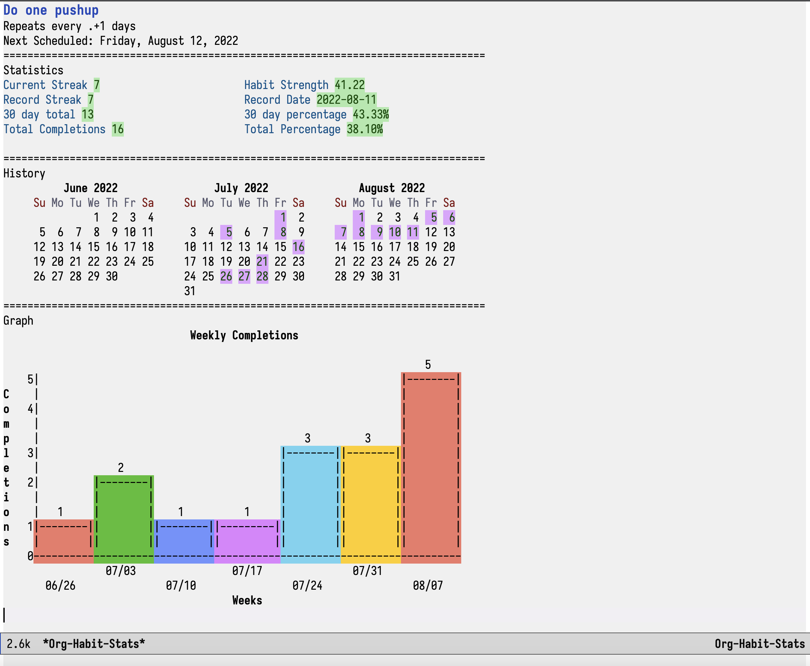

# org-habit-stats.el
[](https://melpa.org/#/org-habit-stats)

View statistics, a calendar, and bar graphs of your habits in Emacs org-mode.

# Screenshots


# Dependencies
- Emacs 25.1

# Installation
This package is available on MELPA as `org-habit-stats`.
Run `M-x package-refresh-contents` and `M-x package-install` and type in the package name to install it.

## Manual Installation
Clone this repo to `~/.emacs.d/site-lisp/`.
Then add this to your config:
``` emacs-lisp
(load "org-habit-stats/org-habit-stats")
```

## Doom Emacs:
``` emacs-lisp
(package! org-habit-stats)
```

# Usage
Use `org-habit-stats-view-habit-at-point` inside org-mode files to view the stats of a habit.
Use `org-habit-stats-view-habit-at-point-agenda` inside org-agenda buffers.
Bind these to keys of your choosing.
``` emacs-lisp
(define-key org-mode-map (kbd "C-c h") 'org-habit-stats-view-habit-at-point)
(define-key org-agenda-mode-map (kbd "H") 'org-habit-stats-view-habit-at-point-agenda)
```

The built-in keybindings for the org-habit-stats buffer are

| Key   | Command                                            |
|-------|----------------------------------------------------|
| q     | org-habit-stats-exit                               |
| ,     | org-habit-stats-view-previous-habit                |
| .     | org-habit-stats-view-next-habit                    |
| <     | org-habit-stats-calendar-scroll-left               |
| >     | org-habit-stats-calendar-scroll-right              |
| C-v   | 'org-habit-stats-calendar-scroll-left-three-months |
| M-v   | org-habit-stats-calendar-scroll-right-three-months |
| C-x ] | org-habit-stats-calendar-forward-year              |
| C-x [ | org-habit-stats-calendar-backward-year             |
| [     | org-habit-stats-scroll-graph-left                  |
| ]     | org-habit-stats-scroll-graph-right                 |
| }     | org-habit-stats-scroll-graph-left-big              |
| {     | org-habit-stats-scroll-graph-right-big             |
| gm    | Switch to monthly graph view                       |
| gw    | Switch to weekly graph view                        |
| gd    | Switch to weekday graph view                       |
| gs    | Switch to daily habit strength graph view          |

To automatically add habit stats as properties of the habit item, use the following:
``` emacs-lisp
(add-hook 'org-after-todo-state-change-hook 'org-habit-stats-update-properties)
```

# Customization
## Messages
Based on the history of a habit, a string (called a "message") may be displayed on a given day. Messages can be used for rewards, encouraging messages, milestone indicators, and more.

Three message functions are provided. (See below for how to add your own message functions.) 
`org-habit-stats-streak-message` shows a message when the current habit streak reaches certain values. The values and messages can be customized in `org-habit-stats-streak-message-alist`.

`org-habit-stats-unstreak-message` shows a message when the current habit unstreak reaches certain values. The values and messages can be customized in `org-habit-stats-unstreak-message-alist`.

`org-habit-stats-comeback-message` shows a message when the current habit streak reaches the previous record habit streak. The message can be customized in `org-habit-stats-comeback-message`.

## Adding your own functions
You can add your own statistics, graph, and message functions.
After writing your function, you must add it to the appropriate (a)list with the required information. (See below for more details.)

All three types of functions must have the same function signature:
``` emacs-lisp
(defun your-new-function (history history-rev habit-data))
```
- `history` contains a list of pairs (date . completed) where date is represented as the number of days since December 31, 1 BC (as is used by many org-mode functions) and completed is 1 if the habit was completed that day, and 0 otherwise.
- `history-rev` is the reverse of `history`.
- `habit-data` is the result of running `org-habit-parse-todo` on a habit. From the docstring for `org-habit-parse-todo`:

``` text
Returns a list with the following elements:
  0: Scheduled date for the habit (may be in the past)
  1: \".+\"-style repeater for the schedule, in days
  2: Optional deadline (nil if not present)
  3: If deadline, the repeater for the deadline, otherwise nil
  4: A list of all the past dates this todo was mark closed
  5: Repeater type as a string
```

### Adding statistics functions
Statistics functions must return a number or string.

After creating your stat function, add it to `org-habit-stats-stat-function-alist` along with a human readable name:
``` emacs-lisp
(add-to-list 'org-habit-stats-stat-function-alist 
'(my-new-stat-function . "Stat Name Here"))
```

### Adding message functions
Message functions must return a string or nil. If it returns nil, no message will be displayed. This allows messages to be used for rewards, encouraging messages, etc.

After creating your message function, add it to `org-habit-stats-message-function-list`:
``` emacs-lisp
(add-to-list 'org-habit-stats-message-function-list
 'my-new-message-function)
```

### Adding graph functions
Graph functions must return a pair `(LABELS . VALUES)`, where LABELS is a list of strings to be used as bar labels and VALUES is a list of numbers to be used as the bar sizes.

After creating your graph function, add it to `org-habit-stats-graph-function-list`. 
``` emacs-lisp
(add-to-list 'org-habit-stats-graph-function-list
 (my-new-graph-function . (:key "a"
                           :title "Title of bar graph here"
                           :x-label "x-axis label here"
                           :y-label "y-axis label here"
                           :dir horizontal
                           :max-bars 10)))
```
The `dir` property can be either `horizontal` or `vertical`, and determines which direction the bar graphs are drawn.
The `max-bars` property determines the maximum number of bars to appear in the graph at a time.

## The Habit Strength score
The Habit Strength score $S_n$ uses a modified form of exponential smoothing (inspired by Loop Habit Tracker's score).
$S_n$ is always bound within $[0,1]$ and is a weighted sum of all completions in the habit history, with more recent completions carrying more weight.
(Note that in the org-habit-stats buffer, the displayed habit strength is $100S_n$.)

The formula is

$$\begin{align*}
S_0 &= 0 \\
S_{n} &= \begin{cases}
(1-\alpha)S_{n-1} + \alpha, & \text{if the habit was completed on Day n} \\
(1-\beta)S_{n-1}, & \text{otherwise}
\end{cases}
\end{align*}$$

where $\alpha, \beta \in [0,1]$.

$\alpha$ determines (roughly) how much each successful completion contributes to the score. At the extremes, $\alpha=0$ means completing the habit has no effect on the score and $\alpha=1$ means completing the habit gives the maximum score of $1$.

$\beta$ is exactly how much the score decreases (in percent) for each miss. For instance, $\beta = 0.2$ means the score decreases by $20$% each day you miss the habit. At the extremes, $\beta = 0$ means misses don't affect the score at all, and $\beta=1$ means misses will reset the score to $0$.

By default, $\alpha = 0.052$ is calibrated so that $66$ consecutive completions reaches a habit strength of $97$ (based on the idea that it takes 66 days to form a habit).  $\beta$ is set to $0.1$ by default. (For comparison, Loop Habit Tracker uses $\alpha=\beta \approx 0.052$ for its habit score.)

To calibrate it such that $n$ consecutive completions reaches a habit strength of $S$, use the following formula:

$$\alpha = 1 - \sqrt[n]{1 - S}$$

# Contribution
I might try to get this package on ELPA, so any significant contributions (at least 15 LOC) requires copyright assignment to the FSF.

# Acknowledgements
Powered by the wonderful built-in packages calendar.el and chart.el.

Inspired by the awesome free and open source app [Loop Habit Tracker](https://github.com/iSoron/uhabits).

# License
GPLv3
